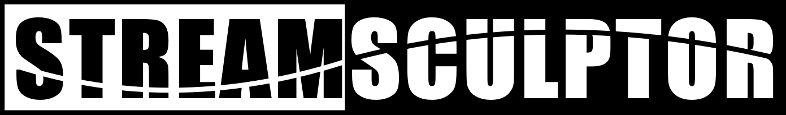

 

StreamSculptor: perturbative and non-perturbative stream models implemented in Jax.

Supports CPU and GPU architectures, automatic differentiation, custom time-dependent potentials.

Auxillary ODEs can be computed along trajectories using the fields module.

Based on Nibauer et al. 2024: https://arxiv.org/abs/2410.21174

### Requirements
Listed in requirements.txt 

Required installations:
- Jax (for backends)
- Diffrax (for differentiable numerical integration)
- Equinox (class structure)
- Interpax (spline interpolation)
- Gala (for unitsystem module)

Optional installations:
- Jaxopt and Optax (for optimization of restricted N-body)
- Agama (for interpolation of spheroidal density and potential)

### Installation
- `git clone https://github.com/jnibauer/streamsculptor.git`
- `cd streamsculptor`
- `python setup.py install`
